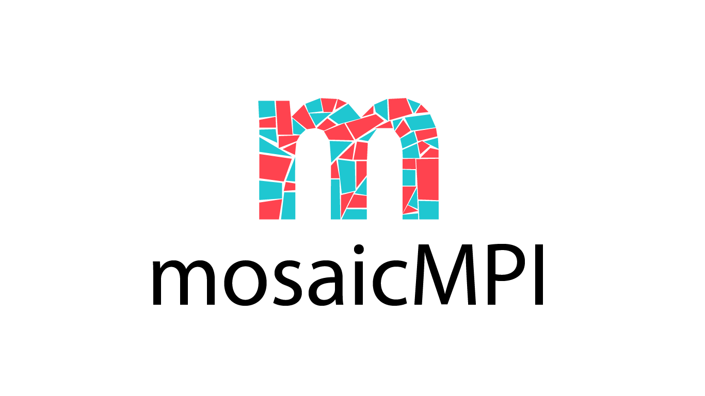

-----------------

# cNMF-SNS: powerful factorization-based multi-omics integration toolkit


<details>
  <summary> future badges </summary>

```md
[](https://pypi.org/project/cnmfsns/)
[](https://anaconda.org/anaconda/cnmfsns/)
[](https://doi.org/10.5281/zenodo.3509134)
[](https://pypi.org/project/cnmfsns/)
[](https://github.com/morrissylab/cnmfsns/blob/main/LICENSE)
[](https://pepy.tech/project/cnmfsns)
```

</details>

**cNMF-SNS** (consensus Non-negative Matrix Factorization Solution Network Space) is a Python package enabling integration of bulk, single-cell, and
spatial expression data between and within datasets. cNMF provides a **robust, 
unsupervised** deconvolution of each dataset into gene expression programs (GEPs).
**Network-based integration** of GEPs enables flexible integration of many datasets
across assays (eg. Protein, RNA-Seq) and patient cohorts.

Communities with GEPs from multiple datasets can be annotated with dataset-specific
annotations to facilitate interpretation.

## :zap: Main Features

Here are just a few of the things that cNMF-SNS does well:

- Integration of expression data does not require subsetting features/genes to
  a shared subset
- Ideal for incremental integration (adding datasets one at a time) since
  deconvolution is performed independently on each dataset generating invariant GEPs
- Does not assume the same level of sparsity/depth (single-cell, bulk)
- Identifies interpretable, additive non-negative gene expression programs
- Two interfaces: command-line interface for rapid data exploration and python
  interface for extensibility and flexibility

## :wrench: Install

### :lock: Pre-release (Private GitHub Repository)

Before installing cNMF-SNS using pip, it is recommended to first set up a separate conda environment and have conda manage as many dependencies as possible.

```bash
conda create --name py39  -c conda-forge python=3.9 anndata pandas numpy scipy matplotlib upsetplot httplib2 tomli tomli-w click pygraphviz python-igraph semantic_version yaml scikit-learn fastcluster scanpy
conda activate py39
```

If you use SSH authentication for GitHub, use the following:

```bash
pip install git+ssh://git@github.com/MorrissyLab/cNMF-SNS.git
```

If you have installed a [personal access token from GitHub](https://github.com/settings/tokens), you can use:

```bash
pip install git+https://<token>@github.com/MorrissyLab/cNMF-SNS.git
```

### :cloud: Public Release

> Note: This will work only when cNMF-SNS has been published to PyPI.

```bash
pip install cnmfsns
```

> Note: This will work only when cNMF-SNS has been published to conda-forge.

```bash
conda install -c conda-forge cnmfsns
```

## :open_book: Documentation

### :notebook: Python interface tutorial

To get started, sample proteomics datasets and a Jupyter notebook tutorial is available [here](/tutorial).

### :computer: Command line interface

See the [command line interface documentation](/CLI.md).

## Getting Help

For errors arising during use of cNMF-SNS, create and browse issues in the [GitHub "issues" tab](https://github.com/MorrissyLab/cNMF-SNS/issues).